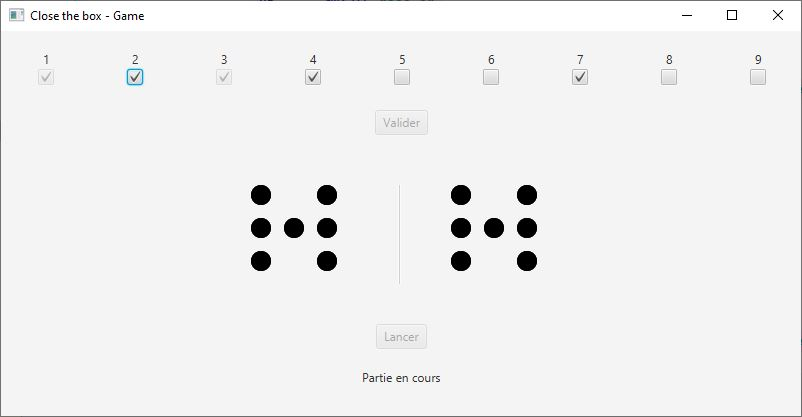

# Close The Box

## Goal
The goal is to **sum check boxes value** by ticking them **to arrive at the random number.**
You can't tick a check box more than once.

*For example if random number is **6**, you can add **`1 + 2 + 3`**, or **`2 + 4`***.*

## End of the game
**The end** of the game happens when **sum of remaining check boxes can't get random number.**

### Why this project ?
I knew this board game during my semester in Canada. I enjoyed playing it, well I tried to reproduce.